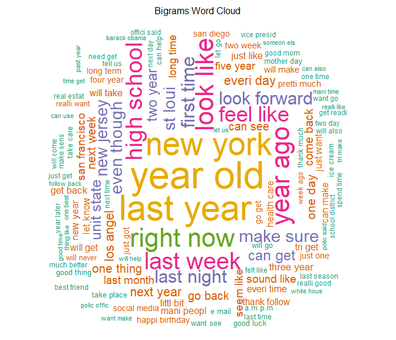

# Milestone Report for NLP Capstone Project
Vadim K.  
22 August 2017  


## Synopsis

The purpose of this document is to provide a milestone report on developing an 
interactive text prediction web app.  
This developement is a part of the capstone project that 
wraps up Coursera Data Science specialization offered by Johns Hopkins University (Baltimore, Maryland).

This application will predict the next word a user most likely will type 
based on the words he/she already typed.  
The server part of application will run a word prediction algorithm that will be finalized later in the project. 
This algorithm is based on N-gram language model built from [HC Corpora](https://web-beta.archive.org/web/20160930083655/http://www.corpora.heliohost.org/aboutcorpus.html) (a set of files with millions lines of text in different languages collected from publicly available sources by a web crawler).

In the present document I will give a brief overview of the first steps of the project 
that were already achieved such as downloading, cleaning and exploring the data. 
I will also share couple of issues I faced and some interesting findings in the data.  
In conclusion you'll find some info about my plans for creating the prediction algorithm and the expected constraints.


## Data Processing


The R packages used during analysis are


```{}
library(stringr) # to count words
library(stringi) # to count max characters (seems faster than stringr)
library(dplyr) # to rename columns of summary table
library(readtext) # to read sample file into a Corpus
library(quanteda) # for all the text mining
library(data.table) # to hold the frequency tables
library(ggplot2) # visualization
```


#### _Loading Data_

The data was obtained from the archive available under following [link](https://d396qusza40orc.cloudfront.net/dsscapstone/dataset/Coursera-SwiftKey.zip).  
It contains texts from 3 types of sources (blogs, news, Twitter) in 4 different locales (en_US, de_DE, ru_RU and fi_FI).  
Files in English were taken for this project (i.e. `"en_US.blogs.txt"; "en_US.news.txt"; "en_US.twitter.txt"`).  


<span style="color:gray">
_There was an issue with loading News file: it containes ASCII `Substitute` character on line 77259, 
this character (decimal 26 or 0x1A) corresponds to Ctrl+Z in Windows so the function `readLines` truncates the file at it and imports only 77259 lines.  
Solution is to launch `readLines` in binary mode (credits to  [this Q on StackOverflow](https://stackoverflow.com/questions/15874619/reading-in-a-text-file-with-a-sub-1a-control-z-character-in-r-on-windows))_
</span>


#### _Summary statistics_
Here is some summary statistics for the chosen files:


                    File size    Total lines   Max. characters per line   Total words   Av. characters per word
------------------  ----------  ------------  -------------------------  ------------  ------------------------
en_US.blogs.txt     248.5 Mb          899288                      40833      37874365                       4.3
en_US.news.txt      249.6 Mb         1010242                      11384      34613673                       4.6
en_US.twitter.txt   301.4 Mb         2360148                        140      30556137                       4.1


****************


#### _Sampling & Cleaning the Data_

As the files are pretty big for the further analysis samples of 100k lines 
were taken from each of them.

I also had to do another cleaning for the sample files, as after the first round of 
exploratory analysis some strange word pairs were discovered among the most popular ones 
(e.g. `"u 009f"`).  
After tracing back the issue many lines with non-ASCII characters were found  

they looked like this in R (being read in binary mode)  
`"Girls night with and ! \xf0\u009f\u0092\u009c"`  

and like this in the original txt file  
`Girls night with and ! 💜`  
<span style="color:gray">_Example from line #1054179 of Twitter file_</span>


## Exploring the Data

For exploring the data I experimented with 3 different packages (`tm`, `tidytext` and `quanteda`).  
Personally I found 'quanteda' the most convenient for this project, so all the further text mining is done with it.  

Also two different approaches were studied of taking the 3 files separately or combining them together. 
The decision was to combine.  

So the following steps were done on text mining stage:  

* The Corpus has been read with `readtext`
* Split into sentences (I found it more logical for further tokenization to treat each sentence separately
not just each line) --> so we got **526 022 sentences**
* Sentences then were split by words (1-gram 'tokens' object) and following transformation done:
    + numbers, punctuation and different symbols removed
    + all words to lower case
    + English stop words removed <span style="color:gray">_(For the sake of exploring and building word clouds. Won't do this for prediction algorithm)_</span>
    + Stemming applied <span style="color:gray">_(btw I find quanteda stemming being the most efficient one)_</span>
* 3 more 'tokens' objects were created (holding 2-, 3- and 4-grams respectively)
* Document-feature matrices created from 'tokens' objects, holding
    +   **112 600 unique unigrams**
    + **2 387 021 unique bigrams**
    + **3 596 041 unique trigrams**
    + **3 295 301 unique four-grams**
* Data.tables were created to hold the frequences of n-grams and be used for further plotting  

And below you can check-out the visualization of most popular n-grams in the studied dataset:


<!-- -->

<!-- -->


And here is another representation of unigrams and bigrams frequencies - by Word Clouds:


<!-- -->
<!-- -->

#### _Couple of interesting findings in text_
Being not from US or Mexico I was not familiar with the term 'Cinco de Mayo'. And finding it
among top 20 popular trigrams lead me to a very interesting reading on Wikipedia :)  


Another one was observing similar mentionings of Amazon among popular four-grams.
Tracing back to original sentences showed that there are many intances of almost the same text mentioning blogs on wordpress with random-generated-looking names.  
See examples below:  

<span style="color:gray">_
"JBFUA Blog (jbfuablog.wordpress.com) is a participant in the Amazon Services LLC and Amazon EU Associates Programmes designed to provide a means for sites to earn advertising fees by advertising and linking to amazon.com, amazon.ca, amazon.co.uk, amazon.de, amazon.fr, amazon.it and amazon.es."_</span>  

<span style="color:gray">_
"XVCYL Blog (xvcylblog.wordpress.com) is a participant in the Amazon Services LLC and Amazon EU Associates Programmes designed to provide a means for sites to earn advertising fees by advertising and linking to amazon.com, amazon.ca, amazon.co.uk, amazon.de, amazon.fr, amazon.it and amazon.es."_</span>  

I visited couple of them - all empty, seem machine generated and differ just by title, 
which is still always related to selling electonics.

## Plans for Prediction Algorithm
сам алгоритм построим на n-gram language model
будем использовать 1-4-граммы и smooting (поэкспериментируем с Good-Turing and 
Katz's back-of)
ограничения:  

* размеры итоговых таблиц (будем использовать data.table, как советуют fellow data scientists on course forum), 
* оперативка на Shiny Server (1 RAM), для экспериментов может сделаем вирт.машину с подобными параметрами

