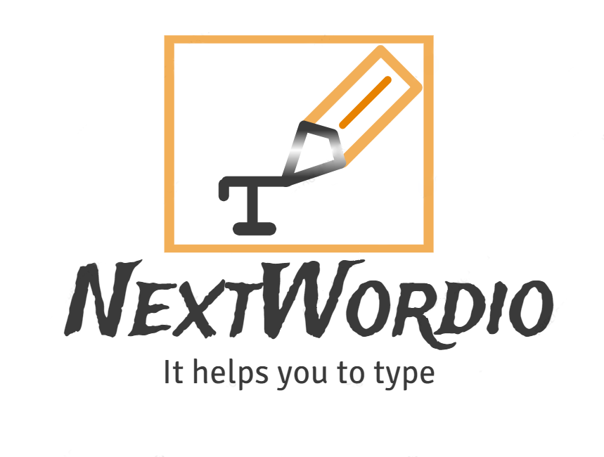
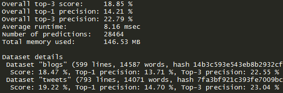
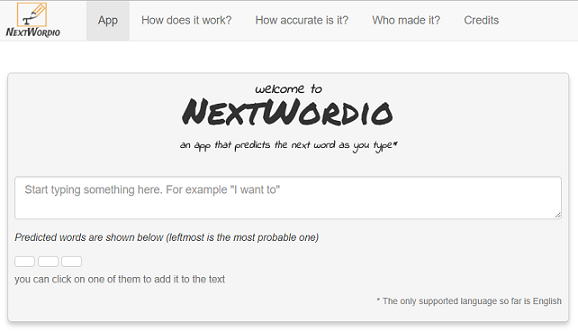
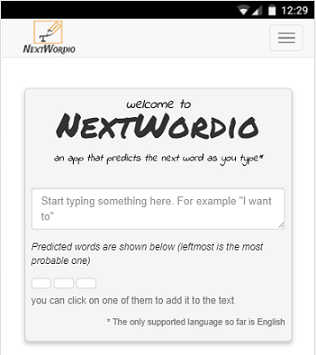

Next Word Prediction App
========================================================
author: Vadim KULAGIN
date: 12.09.2017
autosize: true
transition: linear
  

  
***
  
  
A pitch presentation for the Capstone Project in Coursesa Data Science Specialization.

Meet NextWordio
========================================================

It's an interactive app created under the Capstone Project in Data Science Specialization on
[Coursera](https://www.coursera.org/specializations/jhu-data-science).  

It predicts the next word basing on the ones you've already typed. Just like an 
intellectual keyboard for mobile phones developed by SwiftKey, who acted as industrial
partner for this capstone.  

The app was built using R programming language applying Natural Language Processing
techniques on the 
[text dataset](https://d396qusza40orc.cloudfront.net/dsscapstone/dataset/Coursera-SwiftKey.zip)
provided in class. It was then published on Shinyapps.io server to be available to everyone on the Web.

How does it work?
========================================================
The prediction algorithm in the heart of the app makes use of  
[N-gram](https://en.wikipedia.org/wiki/N-gram) Language Model.  

In brief this means that 4 million lines of text were cleaned and then turned into
5 tables of frequencies for combinations of words (all the way from 5- to 1-gram).  
First (n-1) words in tables were then used to match the entered text and give the last word as prediction.  

A smoothing method called ["Stupid backoff"](http://www.aclweb.org/anthology/D07-1090.pdf) 
was also applied to handle the unseen n-grams: when the model doesn't 
have a matching first 4 words in 5-gram table, it backs off 
to 4-gram table, applying a coefficient of 0.4 to its frequency scores (and so on).

How accurate is it?
========================================================
Performance and accuracy of the model have been measured with an independent 
[benchmarking tool](https://github.com/hfoffani/dsci-benchmark), showing decent results  
  
- Overall accuracy is 18.90%
- Runtime for prediction is below 12 milliseconds
- Model files are using only 18MB on hard drive, and only 146MB when loaded to RAM

Where can I try it?
========================================================
The app was conceived as a fun intuitive tool, optimized for both desktop and mobile
browsers.
         
you can check it out at the following link:  
https://t0tem.shinyapps.io/nextwordprediction/

